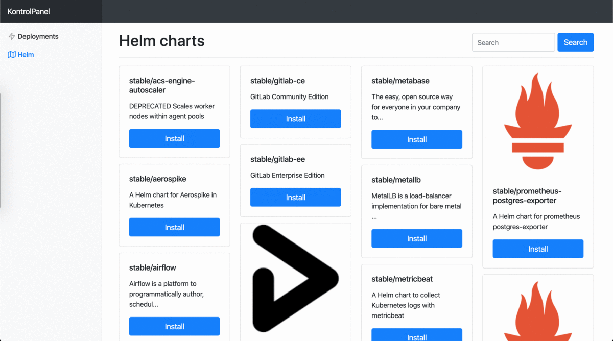

# KontrolPanel
KontrolPanel provides an easy way to control your development Kubernetes cluster. With a click on a button you can install, scale, expose and delete your deployments.



## Prerequisites
* Docker
* A Kubernetes cluster
* Helm/Tiller installed 

## Installation
You can easily run KontrolPanel inside you existing Kubernetes cluster:

```bash
docker build -t kontrolpanel-backend-svc:latest backend_svc
docker build -t kontrolpanel-frontend-svc:latest frontend_svc
kubectl create -f k8s
```
